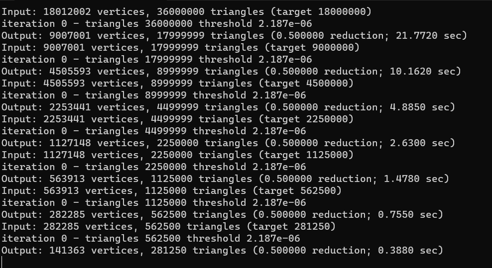

#### 1. 网格简化参考资料

- Openmesh 调库：[openmesh src - decimation - 知乎 (zhihu.com)](https://zhuanlan.zhihu.com/p/599284799) 
- 基于 Openmesh 的 Fast-QEM 解读：[CodeRead and Impl - Fast quadric mesh simplification - 知乎 (zhihu.com)](https://zhuanlan.zhihu.com/p/526522805) 
- 基于 Openmesh 的 Fast-QEM 实现：[grassofsky/OpenMesh-Fast-Quadric-Simplification: Fast quadric mesh simplification using openmesh (github.com)](https://github.com/grassofsky/OpenMesh-Fast-Quadric-Simplification) 
- **Fast-QEM 实现源代码**：[sp4cerat/Fast-Quadric-Mesh-Simplification: Mesh triangle reduction using quadrics (github.com)](https://github.com/sp4cerat/Fast-Quadric-Mesh-Simplification) 

#### 2. VTK LOD实现

- VTK LOD 例子
  - [examples.vtk.org/site/Cxx/Visualization/LODProp3D/](https://examples.vtk.org/site/Cxx/Visualization/LODProp3D/) 
  - [【精选】VTK：体绘制——光照&阴影、VTKLODProp3D_vtk阴影_简 。单的博客-CSDN博客](https://blog.csdn.net/m0_45306991/article/details/124823510?utm_medium=distribute.pc_relevant.none-task-blog-2~default~baidujs_baidulandingword~default-0-124823510-blog-92679921.235^v38^pc_relevant_sort_base1&spm=1001.2101.3001.4242.1&utm_relevant_index=3) 
- VTK 接口
  - [VTK: vtkLODProp3D Class Reference](https://vtk.org/doc/nightly/html/classvtkLODProp3D.html) 
  - [VTK: vtkLODActor Class Reference](https://vtk.org/doc/nightly/html/classvtkLODActor.html) 
- VTK 源码
  - [VTK/Rendering/Core/vtkLODProp3D.h at master · Kitware/VTK · GitHub](https://github.com/Kitware/VTK/blob/master/Rendering/Core/vtkLODProp3D.h)  
  - [VTK/Rendering/LOD/vtkLODActor.h at master · Kitware/VTK · GitHub](https://github.com/Kitware/VTK/blob/master/Rendering/LOD/vtkLODActor.h) 
- VTK 

[CDLOD/src/main.cpp at master · Syllvan/CDLOD · GitHub](https://github.com/Syllvan/CDLOD/blob/master/src/main.cpp) 

[LODGenerator/LODGenerator/src/TriangleV.cpp at master · JFlynnXYZ/LODGenerator · GitHub](https://github.com/JFlynnXYZ/LODGenerator/blob/master/LODGenerator/src/TriangleV.cpp) 

#### 3. 网格简化分析

  